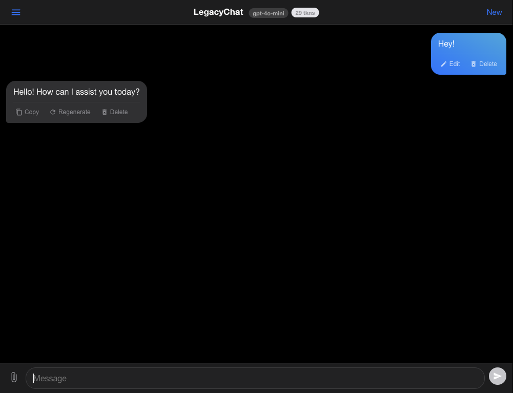
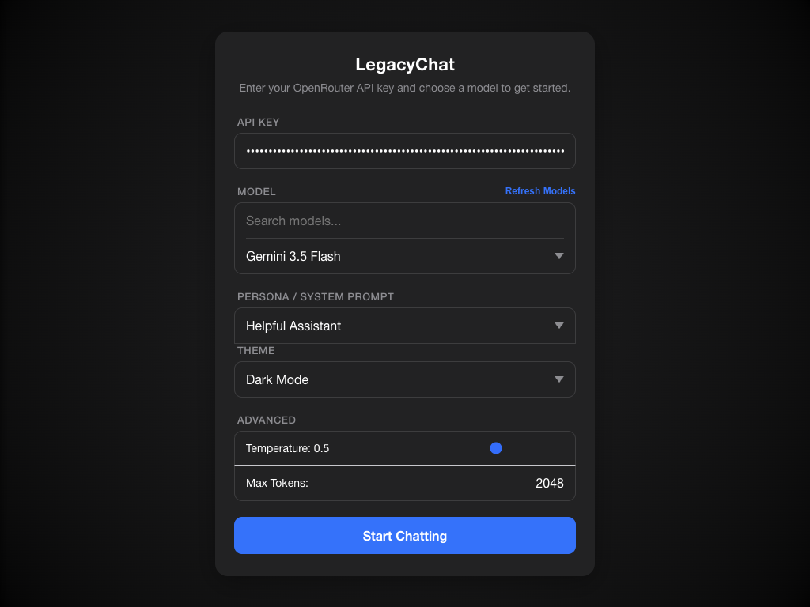
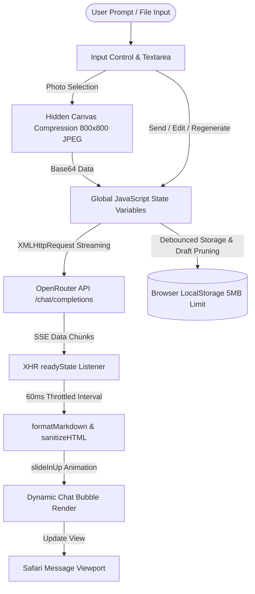
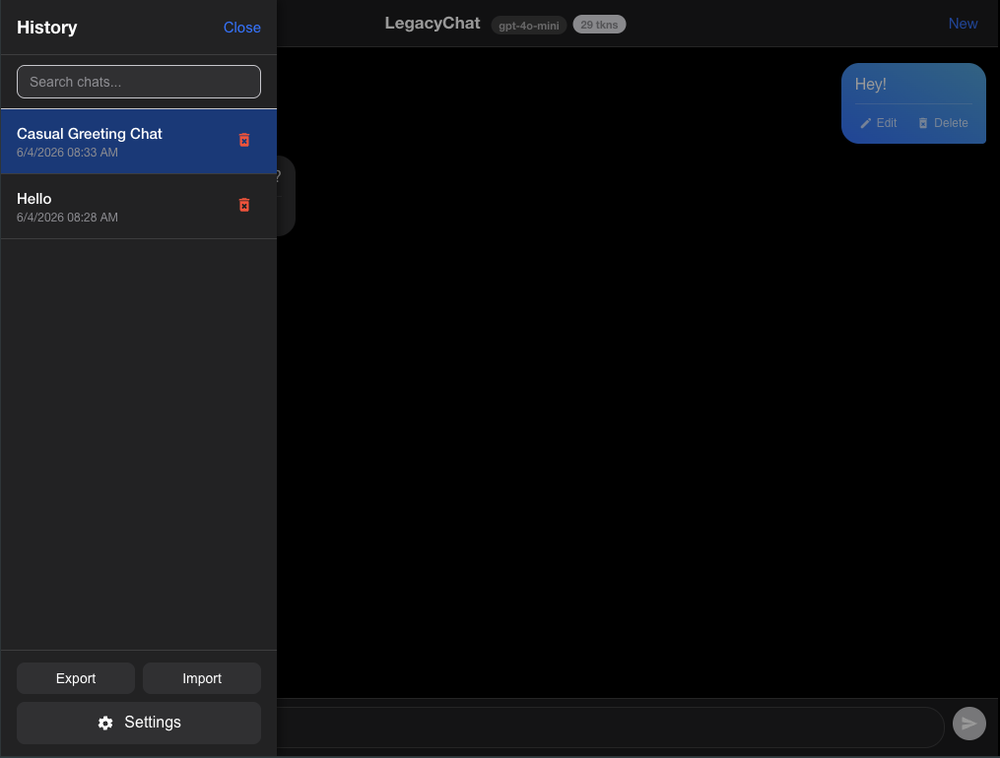
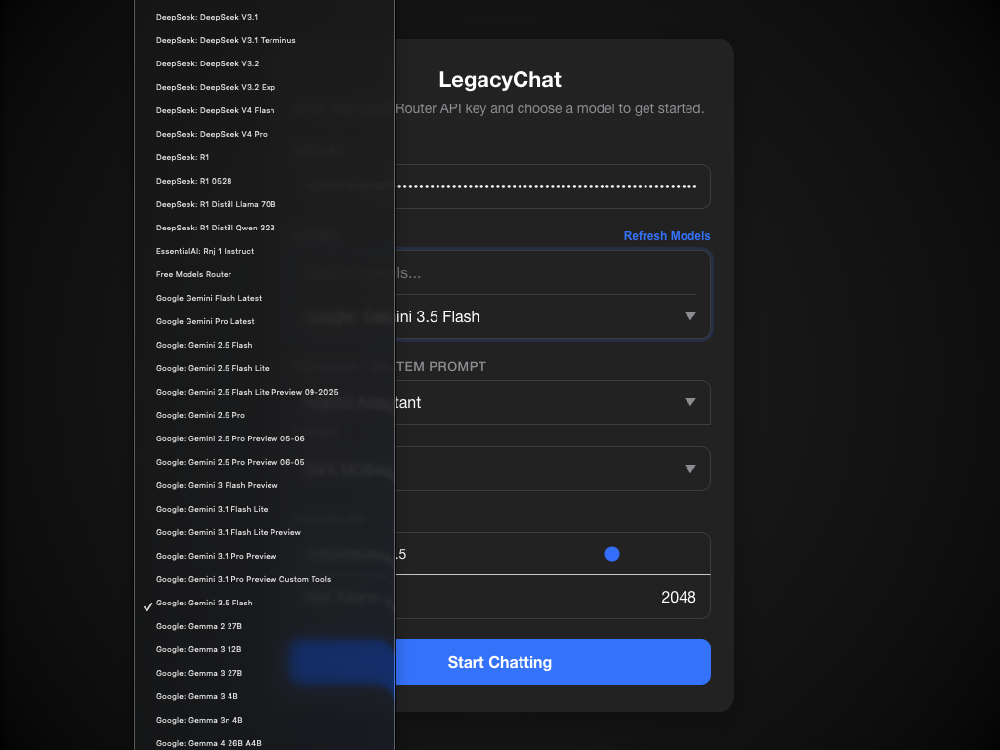
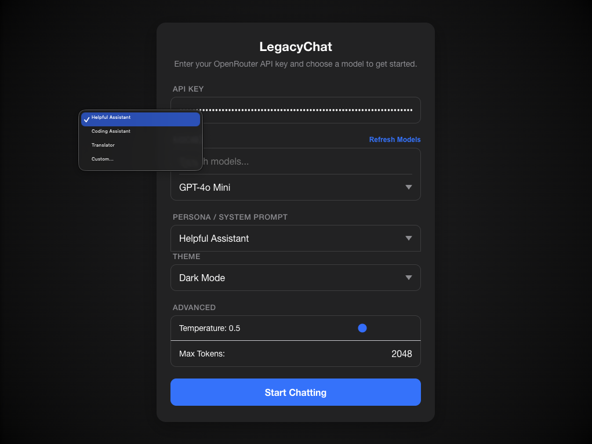
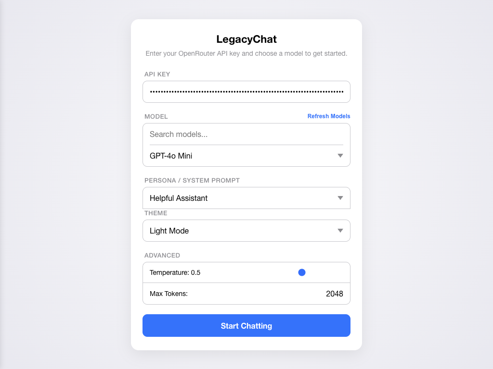

<div align="center">
 
# LegacyChat — iOS 9 Compatible Chatbot

A lightweight, single-file AI chatbot interface built specifically for **iPad Mini 1st Gen (iOS 9.3.6)** and older WebKit browsers. Modern AI web applications rely on `fetch()`, ES6 syntax, and flexbox/grid features unsupported by Safari 9. LegacyChat works around every legacy WebKit limitation with zero dependencies.

[](https://opensource.org/licenses/MIT)
[](https://developer.mozilla.org/en-US/docs/Web/JavaScript)
[](https://developer.mozilla.org/en-US/docs/Web/HTML)
[](https://developer.mozilla.org/en-US/docs/Web/CSS)
[](https://openrouter.ai/)
[](https://vercel.com/)

[Features](#features--highlights) · [Why This Exists](#why-this-exists) · [Project Structure](#project-structure) · [Architecture Flow](#high-level-architecture) · [Quick Start](#quick-start) · [Screenshots](#screenshots) · [Troubleshooting & FAQ](#troubleshooting--faq) · [Guides](#comprehensive-guides) · [License](#license-terms)

</div>

<div align="center">
  
</div>

<a id="setup-screen"></a>

<div align="center">
  
</div>

---

> [!IMPORTANT]
> **Single-File Zero-Dependency Architecture**  
> LegacyChat is contained entirely within a single [`index.html`](file:///Volumes/1TB%20Graphics%20SSD/Sansan_DO_NOT_TOUCH/Projects/legacychat/index.html) file. It requires no npm dependencies, no Webpack/Vite bundlers, and no backend servers. You can run it directly by opening the file or hosting it on any static server.

---

## Features & Highlights

- **🔒 Strict ES5 Compatibility**: Runs on Safari 9.3.6 WebKit engines without `fetch()`, `async`/`await`, `let`/`const`, or ES6 arrow functions.
- **✨ Glassmorphism UI**: Backdrop blur headers and input controls (`-webkit-backdrop-filter: blur(20px)`) with smooth CSS bubble entrance animations (`@keyframes slideInUp`).
- **⚡ 60ms Streaming Render Throttle**: Low-power interval streaming (`~16fps`) engineered for dual-core Apple A5 hardware to eliminate CPU layout thrashing.
- **📋 Inline Code Block Copying**: One-tap code block copying (`copyCodeBlock()`) with instant visual "Copied!" feedback.
- **🔢 Smart Character Counter**: Automatic input character counter surfacing when prompt length exceeds 500 characters.
- **📝 Markdown Engine**: Parses headers, bold, italics, strikethrough (`~~text~~`), lists, syntax-highlighted code blocks, and GFM tables into safe HTML.
- **📸 Image Compression**: Automatic hidden `<canvas>` JPEG compression (scaled to max 800x800, quality 0.6) before converting uploaded camera photos to Base64 payloads.
- **💾 Comprehensive Storage & Draft Management**: Features full JSON chat export/import, individual message editing/deletion, clear-all confirmation modal, and startup stale draft pruning.

---

## Why This Exists

Safari on iOS 9.3.6 (2016-era WebKit) lacks modern web infrastructure:

| Modern Feature | Legacy Support Status | LegacyChat Workaround |
|---|---|---|
| `fetch()` API | ❌ Unsupported | Pure `XMLHttpRequest` with `readyState === 3` SSE buffer parsing |
| `const` / `let` / `=>` | ❌ Unsupported | Strict ES5 JavaScript (`var`, standard functions, string concatenation) |
| `async` / `await` / Promises | ❌ Unsupported | Standard asynchronous callback chains |
| CSS Grid | ❌ Unsupported | `-webkit-flex` flexbox layouts with standard fallbacks |
| CSS Custom Variables | ❌ Unsupported | Class-based theme toggling applied directly to `<body>` |

---

## Project Structure

The codebase is organized as follows:

```text
legacychat/
├── index.html        # Main codebase containing all HTML structure, CSS styles, and JS logic
├── LICENSE           # Standard MIT legal terms
├── README.md         # General project overview, architecture, and quick start guide
├── CHANGELOG.md      # Detailed version history and release notes
├── COMPONENTS.md     # In-depth technical reference for index.html functions & DOM hierarchy
├── API.md            # OpenRouter API specifications, payload schemas, and SSE streaming logic
├── ONBOARDING.md     # Development setup, legacy WebKit guidelines, and USB debugging steps
├── CONTRIBUTING.md   # Guidelines for PRs, coding standards, and issue reports
└── Screenshots/      # Visual assets depicting app themes and views
    ├── Chat.png
    ├── SetupScreen.png
    ├── ChatHistory.png
    ├── Models.png
    ├── Persona.png
    └── LightTheme.png
```

---

## High-Level Architecture

The diagram below illustrates how user interactions, image canvas processing, XHR streaming, throttled markdown rendering, and local storage quota management flow through `index.html`:



---

## Settings & Environment Configuration

> [!NOTE]
> **No Backend Required**  
> LegacyChat has no server backend and does not use `.env` files. All API calls are executed directly from Safari in the client browser. Your OpenRouter API key is stored securely in your device's local browser storage.

### Key Settings Explained
- **API Key (`api_key`)**: OpenRouter authorization token (`sk-or-v1-...`) stored in `localStorage`.
- **Model Selector (`model`)**: Target model slug (e.g. `anthropic/claude-3.5-sonnet` or free models like `meta-llama/llama-3.3-70b-instruct:free`).
- **System Prompt / Persona (`persona_select`)**: System role prompt injected at the start of every completion call (e.g., Coding Assistant, Translator, or Custom).
- **Temperature (`temp`)**: Controls output randomness (0.0 for deterministic code/facts, 2.0 for maximum creativity). Default: `0.7`.
- **Max Tokens (`tokens`)**: Upper boundary for generated completion tokens per call. Default: `2048`.

### Quota Exceeded Management
Safari enforces a strict **5MB quota** on `localStorage`. LegacyChat maintains space by:
1. **Photo Compression**: Camera uploads are resized on a hidden canvas to max 800x800 JPEG before Base64 encoding.
2. **Historical Image Cleansing**: Previous chat threads stored in history automatically replace full image strings with a lightweight SVG placeholder tag.
3. **Automatic Draft Pruning**: Orphaned draft entries (`draft_*`) from deleted chats are automatically purged on startup.

---

## Quick Start

### 1. Get an OpenRouter API Key
1. Visit [openrouter.ai](https://openrouter.ai) and sign up for an account.
2. Navigate to **Keys** → **Create Key** and copy your key (starts with `sk-or-v1-...`).

### 2. Deploy to Vercel (or any Static Host)
1. Create a GitHub repository and push `index.html` to the root directory.
2. Go to [vercel.com](https://vercel.com) → **Add New Project** → import your repository.
3. Click **Deploy** (Vercel automatically hosts standard static HTML files).

### 3. Open on iPad Mini (iOS 9)
1. Launch **Safari** on your iPad Mini and navigate to your deployed URL.
2. Tap the share icon → **Add to Home Screen** to install LegacyChat as a standalone full-screen web app.

---

## Screenshots

| Chat History | AI Models |
| :---: | :---: |
|  |  |

| Persona Selection | Theme (Light Mode) |
| :---: | :---: |
|  |  |

---

## Troubleshooting & FAQ

<details>
<summary><b>1. Error: "This request requires more credits, or fewer max_tokens..."</b></summary>
<br>

This error occurs when your OpenRouter key balance or monthly spending cap is lower than your configured `Max Tokens` limit (2048 tokens).

**Solutions**:
- **Lower Max Tokens**: Open **Settings** in LegacyChat, under **ADVANCED**, change `Max Tokens` from `2048` to `80` or `100`, then click **Start Chatting**.
- **Switch to a Free Model**: Under **Settings** → **MODEL**, pick `Llama 3.3 70B (Free)` or `Llama 3.2 3B (Free)`.
- **Top Up Credits**: Visit your [OpenRouter Keys Dashboard](https://openrouter.ai/keys) to adjust your key limit or add credits.
</details>

<details>
<summary><b>2. Why does the API key reset when I close Safari?</b></summary>
<br>

If Safari is running in **Private Browsing** mode, `localStorage` writes are discarded when tabs close. Disable Private Browsing to persist settings across sessions.
</details>

<details>
<summary><b>3. How do I clear storage if I receive a "Storage Limit Exceeded" alert?</b></summary>
<br>

Open the **History Drawer** (menu icon top-left) and click **Export** to back up your chat threads to a JSON file. Then click **Clear All** to reset local history.
</details>

---

## Comprehensive Guides

For detailed technical analysis and contributor guides:

* [🛠️ Developer Onboarding Guide](ONBOARDING.md): Setup instructions, ES5 syntax constraints, and USB remote debugging.
* [🧩 Component Architecture](COMPONENTS.md): Deep-dive into DOM elements, CSS design systems, and JS function references.
* [🔌 API & Streaming Manual](API.md): Explanation of OpenRouter payloads, base64 vision structures, and SSE buffer parsing.
* [🤝 Contribution Guidelines](CONTRIBUTING.md): Code conventions, testing checklist, and pull request requirements.
* [📜 Changelog](CHANGELOG.md): History of version releases and bug fixes.

---

## License Terms

This project is licensed under the **MIT License** (see [LICENSE](LICENSE)). 

### Simplified Terms:
- **Allows**: Commercial use, modification, distribution, private use, and sublicensing.
- **Requires**: Preservation of original copyright notice and license terms in all distributions.
- **Prevents**: Holding authors or contributors liable for warranties or code claims.
