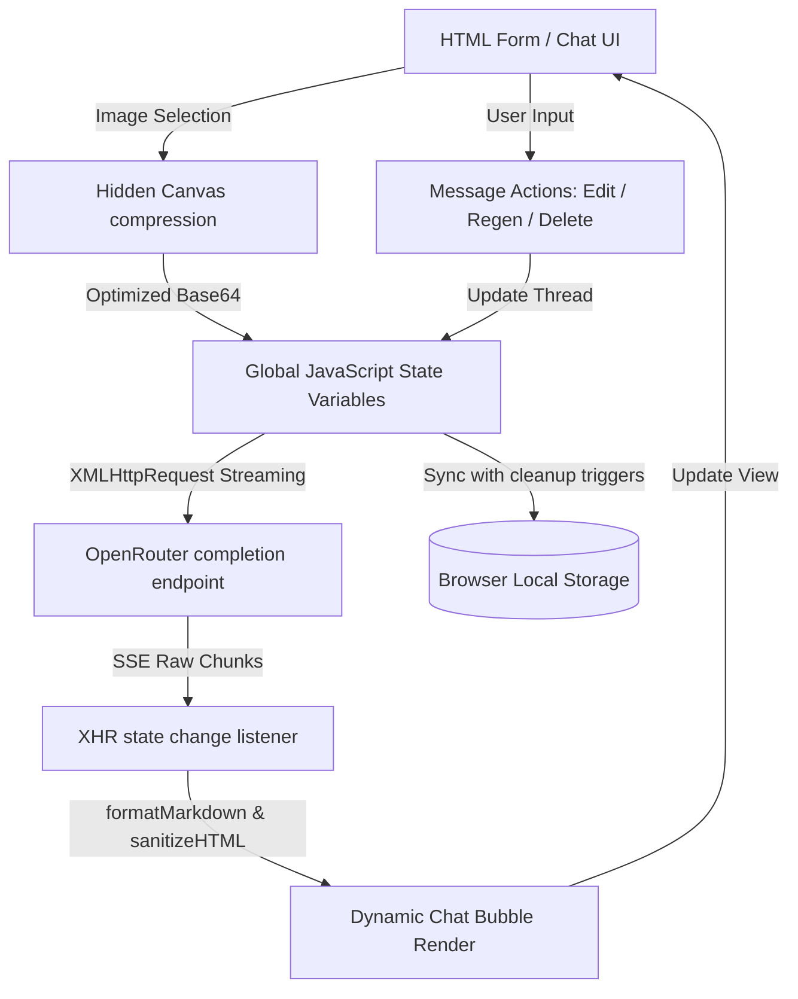

<div align="center">
 
# LegacyChat — iOS 9 Compatible Chatbot

A single-file AI chatbot built specifically for **iPad Mini 1st Gen (iOS 9.3.6)**. Most modern AI chat interfaces rely on APIs and JavaScript features that Safari on iOS 9 does not support. This project works around every one of those limitations.

[](https://opensource.org/licenses/MIT)
[](https://developer.mozilla.org/en-US/docs/Web/JavaScript)
[](https://developer.mozilla.org/en-US/docs/Web/HTML)
[](https://developer.mozilla.org/en-US/docs/Web/CSS)
[](https://openrouter.ai/)
[](https://vercel.com/)

[Why This Exists](#why-this-exists) · [Visual Structure](#project-structure) · [Architecture Flow](#high-level-architecture) · [Quick Start](#quick-start) · [Screenshots](#screenshots) · [Guides](#comprehensive-guides) · [License](#license-terms)

</div>

<div align="center">
  
</div>

<a id="setup-screen"></a>

<div align="center">
  
</div>

---

## Why This Exists

iOS 9.3.6 Safari is a 2016-era WebKit browser. It lacks:

- `fetch()` API
- `const` / `let` / arrow functions (ES6+)
- `async` / `await` / native Promises
- Full CSS Grid and CSS custom properties

This chatbot is written entirely in **ES5 JavaScript** using standard `XMLHttpRequest` SSE-streaming, `-webkit-` prefixed CSS styles, and zero dependencies — no bundler, no npm, no build step.

---

## Project Structure

LegacyChat is designed as a standalone static application. The project is organized as follows:

```text
legacychat/
├── index.html        # The main codebase containing all HTML structure, CSS layouts, and JS logic
├── LICENSE           # Standard MIT legal terms
├── README.md         # General project index and setup guidelines
├── CHANGELOG.md      # Record of changes and feature releases
├── COMPONENTS.md     # In-depth technical guide to index.html functions
├── API.md            # Details of OpenRouter API schema & ES5 SSE-streaming
├── ONBOARDING.md     # Installation and developer workflows
├── CONTRIBUTING.md   # Guidelines for suggestions and PR edits
└── Screenshots/      # Visual assets depicting different screens of the app
    ├── Chat.png
    ├── SetupScreen.png
    ├── ChatHistory.png
    ├── Models.png
    ├── Persona.png
    └── LightTheme.png
```

---

## High-Level Architecture

The diagrams below demonstrate how UI components interact with local states, browser canvas, and OpenRouter completion APIs:



---

## Settings & Environment Configuration

Unlike modern applications, **LegacyChat has no backend and does not use `.env` files** because all requests are sent directly from Safari. Storing keys on a server is not needed, and secrets are managed directly in the client browser.

### Key Settings Explained
- **API Key (`api_key` in localStorage)**: The credentials used to authorize completions with OpenRouter. Entered securely in the Setup screen.
- **Model Selector (`model` in localStorage)**: Slugs pointing to active models (e.g. `anthropic/claude-3.5-sonnet`).
- **Temperature (`temp` in localStorage)**: Controls response variance (0.0 for deterministic factual codes, 2.0 for highly creative answers).
- **Max Tokens (`tokens` in localStorage)**: Controls the hard limit for output tokens per generation call.

### Quota Exceeded Management
Safari imposes a strict **5MB boundary** on `localStorage`. LegacyChat works around this by:
1. **Compressing Uploaded Photos**: Images are resized on a hidden canvas down to maximum 800x800 resolution and compiled as a 60% quality JPEG before saving to Base64.
2. **Dynamic Cleanup**: When saving conversations to storage, historical images from previous threads are cleared and replaced with a tiny placeholder SVG to ensure settings and texts never exceed the 5MB quota.

---

## Quick Start

### 1. Get an OpenRouter API Key
1. Go to [openrouter.ai](https://openrouter.ai) and create a free account
2. Navigate to **Keys** → **Create Key** and copy the key (starts with `sk-or-v1-...`)

### 2. Deploy to Vercel
1. Create a new GitHub repository (can be private)
2. Upload `index.html` to the root of the repo
3. Go to [vercel.com](https://vercel.com) → **Add New Project** → import your repo
4. Click **Deploy** (Vercel automatically detects the static `index.html`)

### 3. Open on iPad Mini
1. Open **Safari** on your device and navigate to your Vercel URL.
2. (Optional) Tap the share icon → **Add to Home Screen** for a standalone app-like experience.

---

## Screenshots

| Chat History | AI Models |
| :---: | :---: |
|  |  |

| Persona Selection | Theme (Light Mode) |
| :---: | :---: |
|  |  |

---

## Comprehensive Guides

To drill down into specific development and architectural features, check out these guides:

* [🛠️ Developer Onboarding Guide](ONBOARDING.md): Step-by-step instructions on setting up tunnels and testing Safari 9 configurations.
* [🧩 Code Component Deep-Dive](COMPONENTS.md): Complete list of globals, styles, and functions like `formatMarkdown()`.
* [🔌 API & Streaming Manual](API.md): Explanation of standard `XMLHttpRequest` SSE-streaming algorithms.
* [🤝 Contribution Guidelines](CONTRIBUTING.md): Details on suggesting features, coding styles, and submitting PRs.
* [📜 Changelog](CHANGELOG.md): History of feature updates, XSS fixes, and release milestones.

---

## License Terms

This project is licensed under the **MIT License** (see [LICENSE](LICENSE)). 

### Simplified Terms:
- **Allows**: Commercial use, modifications, distribution, private use, and sublicensing.
- **Requires**: Including the copyright notice and license text in any distributions.
- **Prevents**: Holding the authors liable for any damages or code warranties.
