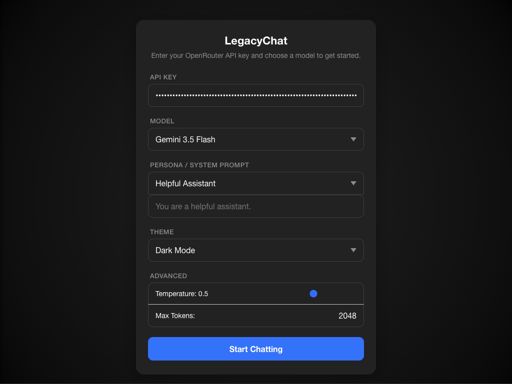

# LegacyChat — iOS 9 Compatible Chatbot

A single-file AI chatbot built specifically for **iPad Mini 1st Gen (iOS 9.3.6)**. Most modern AI chat interfaces rely on APIs and JavaScript features that Safari on iOS 9 does not support. This project works around every one of those limitations.

---

## Why This Exists

iOS 9.3.6 Safari is a 2016-era WebKit browser. It lacks:

- `fetch()` API
- `const` / `let` / arrow functions (ES6+)
- `async` / `await` / native Promises
- Full CSS Grid and CSS custom properties

This chatbot is written entirely in **ES5 JavaScript** using `XMLHttpRequest`, `-webkit-` prefixed CSS, and zero dependencies — no bundler, no npm, no build step.

---

## Features

### Core Chat Experience
- **Multi-turn conversation** with full message history
- **10 model choices** via OpenRouter (Claude, GPT-4o, Gemini, Llama, Nemotron)
- **Vision/Image Support**: Upload images directly from your camera roll to vision-capable AI models.
- **System Prompt Personas**: Select pre-configured personas or write and **save your own custom personas** persistently.
- **Message Actions**: Regenerate AI responses, edit your previous messages, or copy AI text to your clipboard.
- **Auto-Save Drafts**: Input is saved on every keystroke, preventing accidental data loss if Safari refreshes.
- **Stop Generation**: Instantly halt long or unwanted AI responses with a dedicated stop button.
- **Dynamic Chat Titles**: Conversations automatically generate short summarizing titles after the first message.
- **Token Tracking**: View session token usage live in the navigation bar.

### Organization & Settings
- **Chat History**: Multi-session persistent chat histories saved in `localStorage` with an iOS-native slide-out drawer.
- **History Search**: Instantly filter and find past conversations using the built-in search bar.
- **Export & Import**: Download your chat histories as a JSON file and import them back at any time.
- **Persistent Settings**: Saves API key, model choice, system prompt, advanced parameters, and theme in `localStorage`.
- **Dark Mode Support**: Selectable themes (Light and Dark) matching iOS native dark mode aesthetics.

### UI & Polish
- **iOS-native visual design**: Uses the system font, blue/white bubbles, and iOS-style dialogs.
- **Advanced Markdown Rendering**: Custom ES5-compatible parser supporting code blocks, lists, headers, **tables**, bold, italic, and **syntax highlighting** for strings/numbers/comments.
- **Smart Scroll**: A floating "Scroll to Bottom" button appears when reading long messages or navigating history.
- **Smart Send Button**: Dynamically enabled/disabled based on text content and image attachments.
- **PWA Ready**: Add to Home Screen for a native app experience with a custom icon and standalone window.
- Typing indicator (animated bouncing dots) and auto-growing textarea input.
- Error messages displayed inline as bubbles.

---

## Screenshots

| Chat Interface | Chat History |
| :---: | :---: |
|  |  |

| AI Models | Persona Selection |
| :---: | :---: |
|  |  |

| Setup Screen | Theme (Dark Mode) |
| :---: | :---: |
|  |  |

---

## Tech Stack

| Layer | Choice | Reason |
|---|---|---|
| Language | ES5 JavaScript | Only JS standard iOS 9 Safari fully supports |
| HTTP | `XMLHttpRequest` | `fetch()` is unsupported on iOS 9 |
| CSS | Flexbox + `-webkit-` prefixes | CSS Grid and custom properties have poor iOS 9 support |
| API | OpenRouter | One API key, access to multiple AI models |
| Hosting | Vercel (static) | Solves CORS; `file://` origin blocks API requests |
| Structure | Single `index.html` | No build process, no dependencies |

---

## Setup & Deployment

### 1. Get an OpenRouter API Key

1. Go to [openrouter.ai](https://openrouter.ai) and create a free account
2. Navigate to **Keys** → **Create Key**
3. Copy the key (starts with `sk-or-v1-...`)

### 2. Deploy to Vercel

1. Create a new GitHub repository (can be private)
2. Upload `index.html` to the root of the repo
3. Go to [vercel.com](https://vercel.com) → **Add New Project** → import your repo
4. Leave all settings as default — Vercel auto-detects it as a static site
5. Click **Deploy**
6. Your app will be live at `https://your-project-name.vercel.app`

### 3. Open on iPad Mini

1. Open **Safari** on your iPad Mini running iOS 9.3.6
2. Navigate to your Vercel URL
3. (Optional) Tap the share icon → **Add to Home Screen** for an app-like experience

---

## First-Time Configuration

When you open the app, you'll see the setup screen:

| Field | Description |
|---|---|
| **API Key** | Your OpenRouter key (`sk-or-v1-...`) |
| **Model** | Choose from the 10 available models (see below) |
| **Persona / System Prompt** | Select a pre-configured persona or choose "Custom..." to write your own behavior instructions. |
| **Theme** | Select between Light Mode and Dark Mode. |
| **Advanced** | Expandable section to tweak AI Temperature and Max Tokens for fine-grained control. |

Tap **Start Chatting** to enter the chat screen.

---

## Available Models

| Model | Best For |
|---|---|
| Claude 3 Haiku | Fast, lightweight responses |
| Claude 3.5 Sonnet | Balanced speed and intelligence (default) |
| Claude 3 Opus | Deep reasoning, complex tasks |
| GPT-4o Mini | Fast OpenAI option |
| GPT-4o | Flagship OpenAI model |
| Gemini 3.5 Flash | Google's advanced fast model |
| Gemini 3.1 Flash Lite | Ultra low-latency workloads |
| Llama 3.2 3B (Free) | Meta's free lightweight tier |
| Llama 3.3 70B (Free) | Meta's free high-quality tier |
| Nemotron 3 Nano Omni (Free) | NVIDIA's free conversational reasoning tier |

You can switch models anytime by tapping **Settings** in the top-left corner.

---

## Project Structure

```
/
└── index.html    ← entire application (HTML + CSS + JS)
└── README.md
```

No `package.json`, no `/src`, no build artifacts. The entire app is one file.

---

## Security Note

Your API key is entered at runtime in the browser and sent directly to OpenRouter's API. It is **never stored on any server** — it only lives in the page's memory for the duration of your session.

However, since this is a client-side app, anyone who has your Vercel URL can open the setup screen and use their own key — or yours if you share it. For personal use on your own device, this is fine. If you want to restrict access, Vercel supports password protection under **Project Settings → Password Protection** (requires a Pro plan).

---

## Customization

### Change the default model

In `index.html`, find the `<select id="model-select">` element and add the `selected` attribute to your preferred `<option>`.

### Add more models

Add a new `<option>` inside `<select id="model-select">` using any model slug from [openrouter.ai/models](https://openrouter.ai/models):

```html
<option value="mistralai/mistral-7b-instruct">Mistral 7B</option>
```

---

## Browser Compatibility

| Browser | Supported |
|---|---|
| Safari iOS 9.3.6 (iPad Mini 1st Gen) | ✅ Yes — primary target |
| Safari iOS 10+ | ✅ Yes |
| Chrome / Firefox (modern) | ✅ Yes |
| IE 11 | ❌ No (`XMLHttpRequest` usage differs) |

---

## License

MIT — use it however you like.
